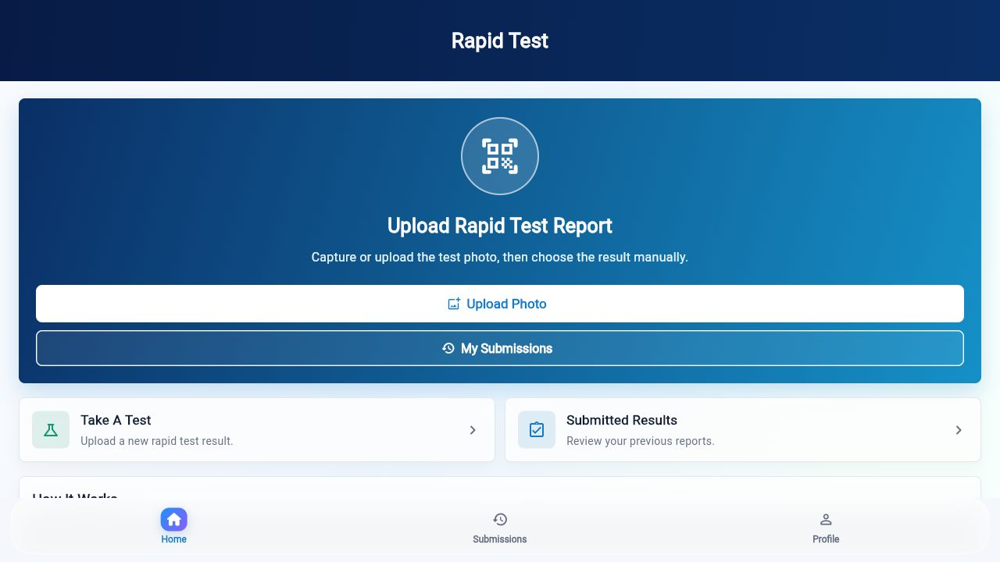
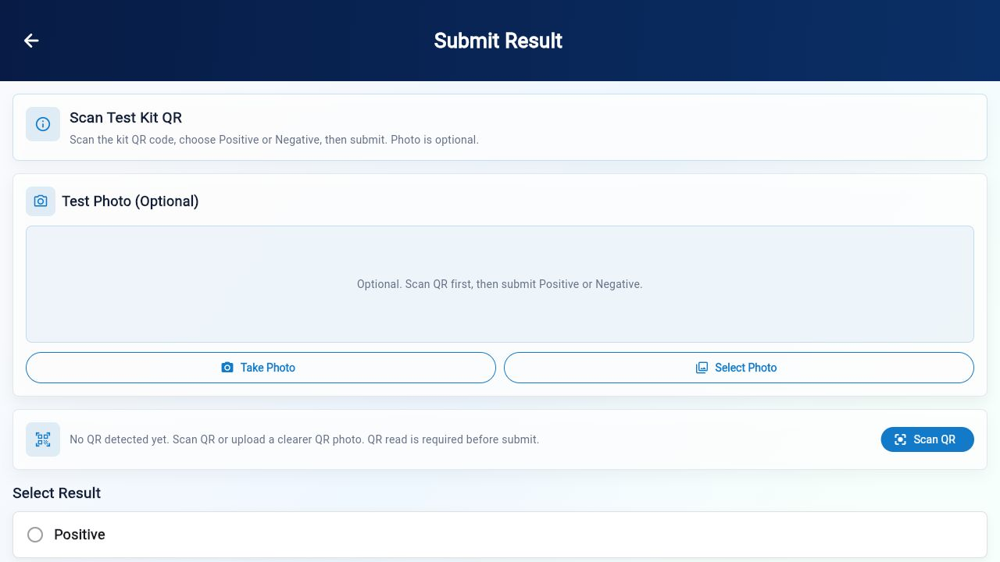
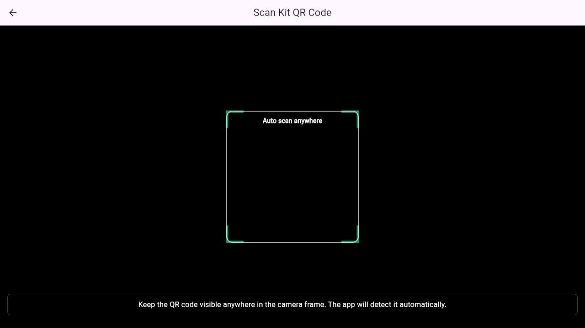
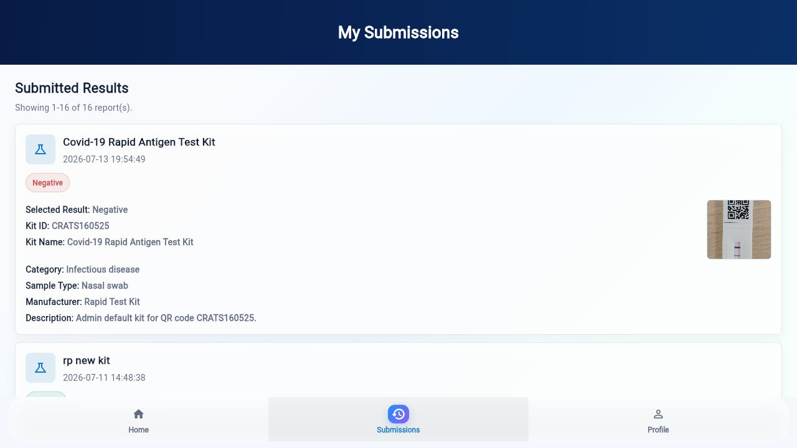
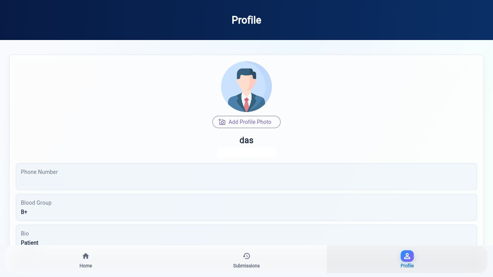

# Rapid Test

Rapid Test is a Flutter and Firebase app for collecting rapid diagnostic test
submissions. Users can scan/read a kit QR code, optionally attach a kit photo,
select the test result, and submit the record. Admin users can manage QR kit
reference data, review records, filter submissions, view reporting summaries,
and export dataset data.

## Overview

This project is built for a realistic rapid-test data collection workflow:

- Patients or field users sign in, scan kit QR data, optionally attach test-kit
  evidence, and submit results.
- QR data is parsed from live camera scans or uploaded kit photos.
- Firestore stores normalized dataset records with test, kit, user, image, and
  timestamp details.
- Admin users can maintain known QR kit records, inspect submissions, filter by
  result/date/search terms, update review status, and export records for
  reporting or backup.

## App Screenshots

<table>
  <tr>
    <td align="center">
      
      <br>
      <sub>User dashboard</sub>
    </td>
    <td align="center">
      
      <br>
      <sub>Test submission</sub>
    </td>
  </tr>
  <tr>
    <td align="center">
      
      <br>
      <sub>QR scanner</sub>
    </td>
    <td align="center">
      
      <br>
      <sub>Submissions</sub>
    </td>
  </tr>
  <tr>
    <td align="center" colspan="2">
      
      <br>
      <sub>Profile and settings</sub>
    </td>
  </tr>
</table>

## Features

| Icon | Feature | Description |
| --- | --- | --- |
| 🔐 | Authentication | Firebase Authentication powers login, signup, forgot-password, and protected user/admin routes. |
| 🧪 | Rapid Test Submission | Users can create a rapid-test report with kit photo, QR details, and Positive/Negative result selection. |
| 📷 | Optional Photo Evidence | Uses device camera or gallery uploads through `image_picker`, with preview support before submission. |
| ▣ | QR Code Reading | Supports live QR scanning with `mobile_scanner` and QR extraction from uploaded images. |
| 🧾 | Structured Dataset Records | Submissions are saved with record ID, user info, kit data, result, image metadata, and timestamps. |
| ☁️ | Firebase Backend | Uses Firebase Core, Auth, Cloud Firestore, and Firebase rules for app data, accounts, QR kits, and dataset records. |
| 🖼️ | Media Handling | Small submission photos are embedded in dataset records; QR kit images can upload to Cloudinary with an embedded fallback. |
| 👤 | User Profile | Users can view and update basic profile details and profile photo information. |
| 📚 | Submission History | Users can browse previous submissions with result status, kit information, timestamps, and attached image preview. |
| 🛠️ | Admin Dashboard | Admin interface includes dashboard metrics, QR kit/data entry, scan records, reports, export history, and profile navigation. |
| 🔎 | Search & Filters | Admin records can be searched and filtered by result type and date range. |
| 📊 | Reports View | Includes summary cards and chart-style visualizations for positive/negative dataset activity. |
| 📤 | Export Tools | Dataset records can be exported as CSV, JSON, or Excel-compatible XLS output. |
| 🧰 | Export History | Recent exports are tracked locally with delete/remove support where available. |
| 🛡️ | Security Rules | Firestore and Storage rules are included for Firebase deployment review. |
| 📱 | Cross-Platform Flutter | Includes Android, iOS, and web project folders generated for Flutter. |

## Tech Stack

- **Framework:** Flutter / Dart
- **State & Navigation:** GetX plus Flutter routes
- **Backend:** Firebase Core, Firebase Auth, Cloud Firestore, Firebase rules
- **QR Scanning:** `mobile_scanner`
- **Media:** `image_picker`, embedded image data URLs, optional Cloudinary QR kit image uploads
- **Exports:** CSV, JSON, and Excel-compatible HTML/XLS output
- **Platforms:** Android, iOS, and Web
- **Helper Scripts:** Node/Firebase Admin scripts for storage checks and sample
  data seeding

## Quick Start

1. Install Flutter: <https://docs.flutter.dev/get-started>
2. Configure Firebase for your target platforms.
3. Add the required Firebase config files:
   - Android: `android/app/google-services.json`
   - iOS: `ios/Runner/GoogleService-Info.plist`
   - Flutter options: `lib/firebase_options.dart`
   - Optional root helpers: service account credentials for Firebase Admin
     scripts, if you plan to run the Node utilities.
4. Install dependencies and run the app:

```bash
flutter pub get
flutter run
```

## Firebase Setup Notes

- Review `firestore.rules` and `storage.rules` before deploying to production.
- Make sure Firebase Authentication providers are enabled in the Firebase
  Console.
- Confirm that Firestore collections used by the app match your security rules,
  especially:
  - `users`
  - `usernames`
  - `dataset_records`
  - `qr_kits`
- Admin access is tied to the configured admin account and the matching
  Firestore user role.
- Firebase Storage support remains in the project for legacy image paths and
  rules review. Current dataset submissions store small optional photos directly
  in Firestore as data URLs, and QR kit images can use Cloudinary when
  configured.

## Cloudinary Setup

QR kit image uploads use `CloudinaryService` when configured. The app has
development defaults, but production builds should pass explicit values:

```bash
flutter run \
  --dart-define=CLOUDINARY_CLOUD_NAME=your_cloud_name \
  --dart-define=CLOUDINARY_UPLOAD_PRESET=your_unsigned_upload_preset
```

If Cloudinary upload fails or is not configured, small QR kit images fall back to
embedded data URLs.

## Project Structure

```text
android/                         Android platform project
ios/                             iOS platform project
web/                             Flutter web assets and manifest
assets/                          App images and rapid-test visual assets
lib/main.dart                    App bootstrap, Firebase init, and routes
lib/firebase_options.dart        Firebase platform options
lib/All in one/                  Main user, admin, auth, and submission screens
lib/All in one/ADMIN/            Admin login, dashboard, reports, and exports UI
lib/All in one/Registrations/    Login, signup, and forgot-password screens
lib/models/                      Dataset record model
lib/services/                    Database, export, QR parser, and platform helpers
lib/widgets/                     Shared UI widgets
test/                            Flutter test scaffold
firestore.rules                  Firestore security rules
storage.rules                    Firebase Storage security rules
reset-password.js                Password reset helper script
seed-sample-records.js           Sample dataset seeding helper
check-storage.js                 Firebase Storage availability helper
enable-storage.js                Firebase Storage setup helper
enable_storage.py                Firebase Storage setup helper
```

## Important Files

- `lib/All in one/qr_result_submission_page.dart` - rapid-test photo upload, QR
  scan/read, result selection, and record submission flow.
- `lib/All in one/TestsFiles.dart` - authenticated user home, submission history,
  and profile experience.
- `lib/All in one/ADMIN/adminConsole.dart` - admin dashboard, filters, reports,
  exports, and recent export history.
- `lib/services/database_service.dart` - Firestore records, QR kit lookup, and
  media persistence logic.
- `lib/services/cloudinary_service.dart` - optional Cloudinary image upload
  support for QR kit images.
- `lib/services/export_service.dart` - CSV, JSON, and XLS export generation.
- `lib/services/qr_parser_service.dart` - QR payload parsing and known test-type
  detection.
- `lib/models/dataset_record_model.dart` - normalized dataset record structure.

## Available Commands

```bash
flutter pub get
flutter analyze
flutter test
flutter run
flutter build apk
flutter build web
npm install
npm run seed:samples
```

## Deployment

For Firebase deployment, verify the active project first:

```bash
firebase use
firebase deploy --only firestore:rules,storage
```

For Flutter web hosting, build the web app before deploying:

```bash
flutter build web
firebase deploy --only hosting
```

## Contributing

1. Fork the repository.
2. Create a feature branch.
3. Make focused changes and add tests where useful.
4. Run analysis/tests before opening a pull request.
5. Describe the user-facing change and any Firebase rule or config impact.

## Support

Open a GitHub issue with:

- Steps to reproduce
- Expected behavior
- Actual behavior
- Device/platform details
- Relevant logs or screenshots
